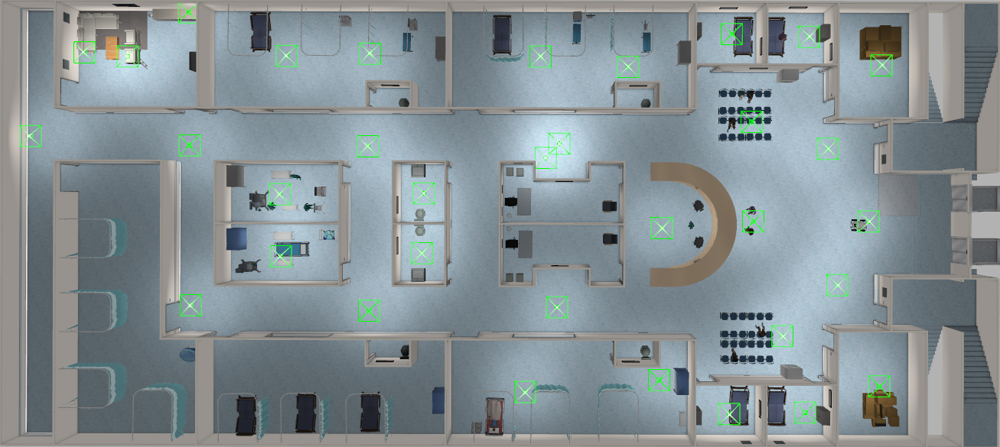
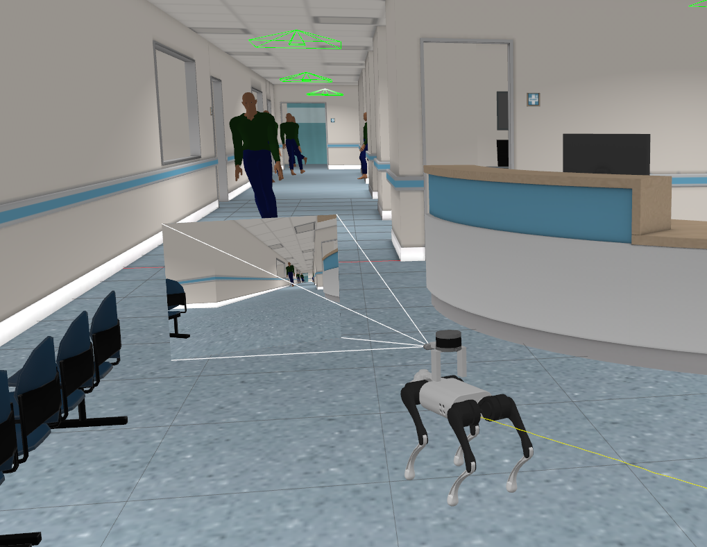

# DSP-navigation: Dynamic Social Planner navigation

## Dependencies
* Social Force Model library
```
cd /usr/local/include
sudo git clone https://github.com/robotics-upo/lightsfm.git
cd lightsfm
sudo make
sudo make install
```
* 
```
sudo apt-get update
sudo apt-get install liblcm-dev
sudo apt-get install ros-noetic-controller-interface ros-noetic-gazebo-ros-pkgs ros-noetic-gazebo-ros-control ros-noetic-joint-state-controller ros-noetic-effort-controllers ros-noetic-joint-trajectory-controller ros-noetic-realsense2-camera ros-noetic-amcl ros-noetic-move-base ros-noetic-slam-gmapping ros-noetic-hector-slam ros-noetic-map-server ros-noetic-global-planner ros-noetic-dwa-local-planner
```

## Installation
1. Clone GitHub Repositories:

```
cd ~/catkin_ws/src
git clone https://github.com/iminolee/dsp-navigation.git
```
2. Build Workspace :
```
cd ../..
catkin_make
source devel/setup.bash
```

## Simulation Setup



## Running
1. Spawn Unitree Go1 quadruped robot into Hospital Environment at the starting location:
```
roslaunch gazebo_simulator main.launch
```

